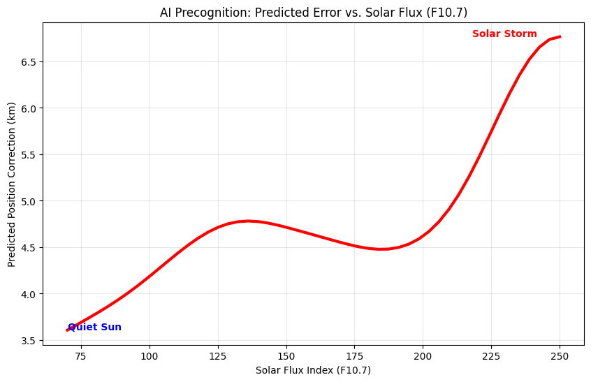
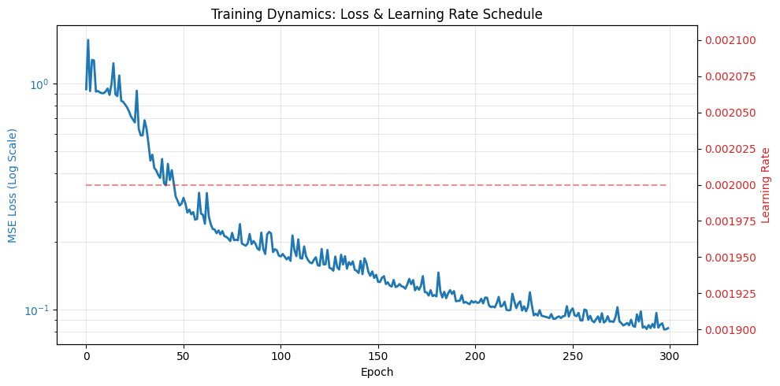
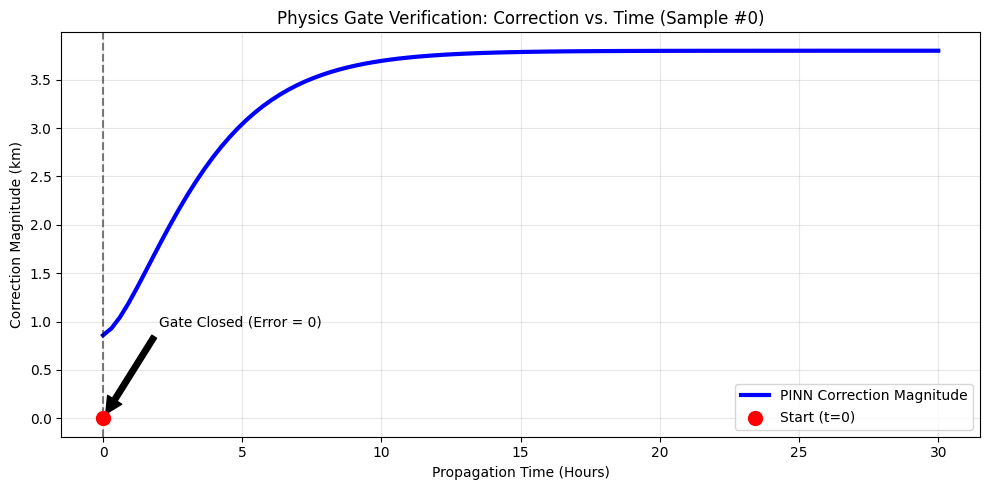
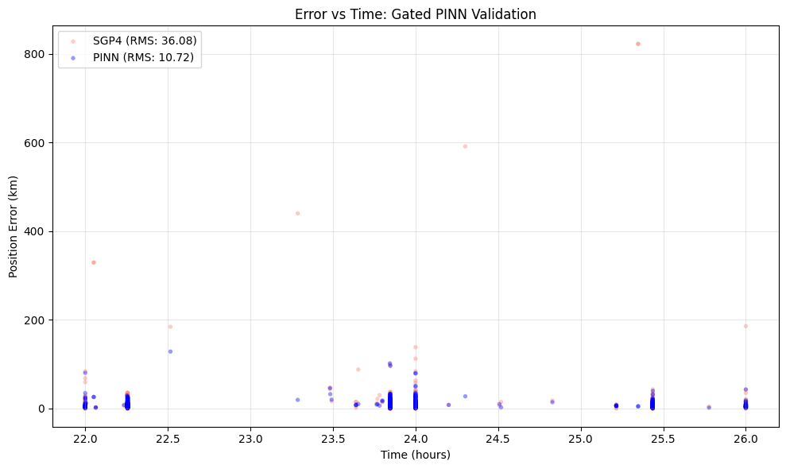
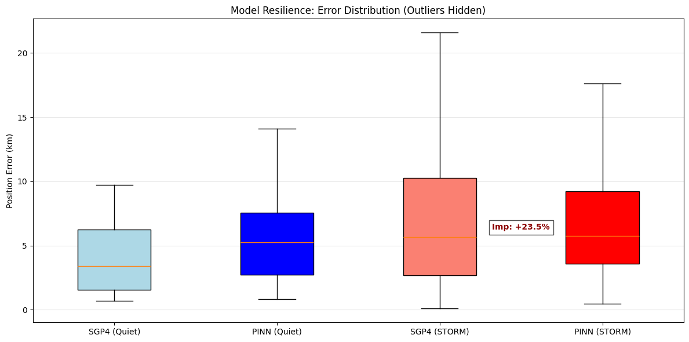
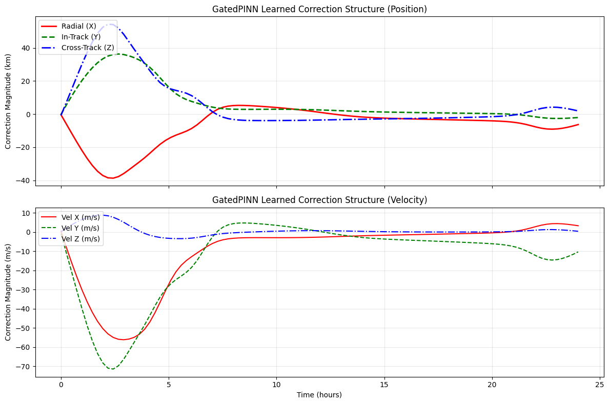
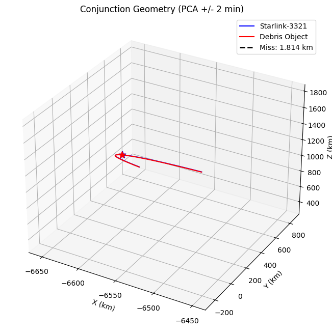
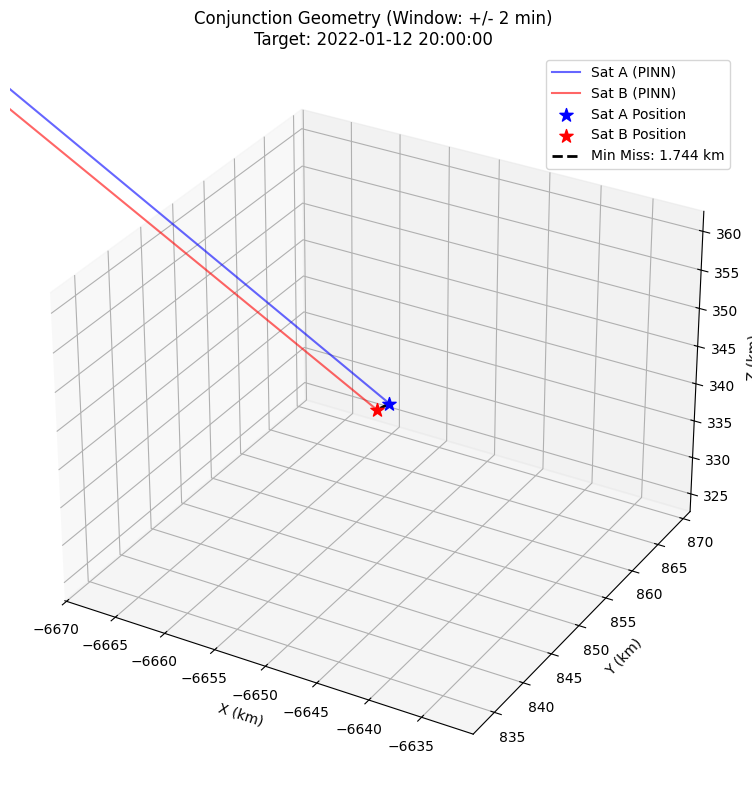
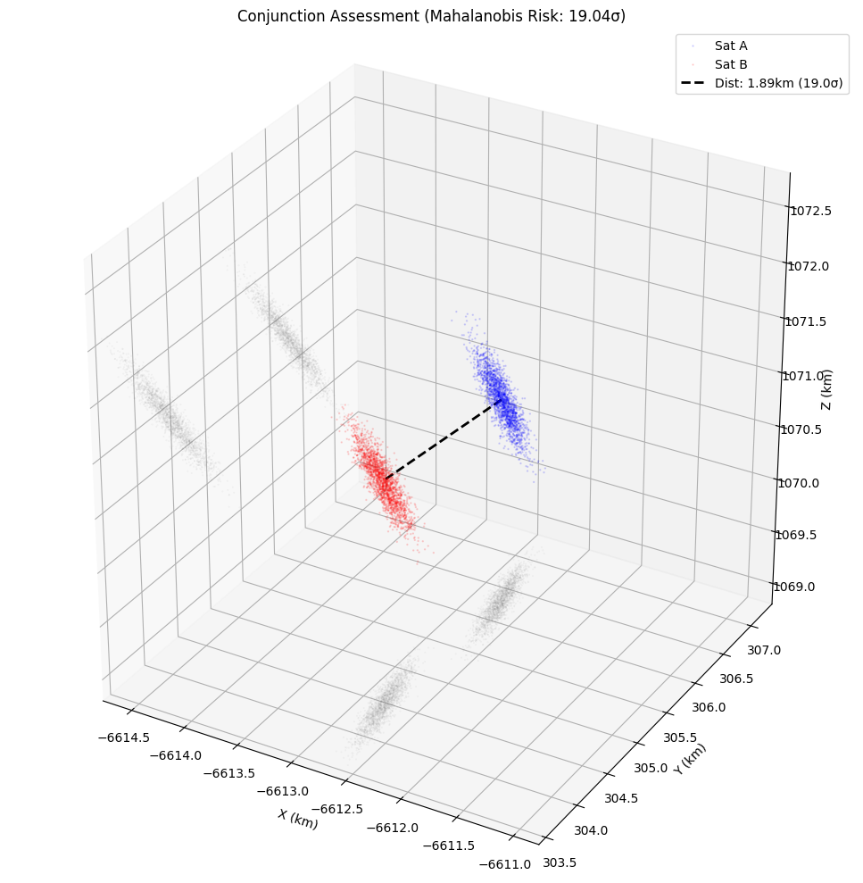

# Summary

LEO traffic management now operates under elevated risk due to the joint effects of constellation densification and Solar Cycle 25 storm activity. This paper extends our prior G-PINN analysis with 2025--2026 context and operational validation. The proposed Physics Gate, $\Gamma(t)=\tanh(\lambda t)$, acts as a hard kinematic constraint that guarantees zero correction at epoch and eliminates Phantom Drift. In storm-dominated regimes, this architecture improves mean 24-hour error from 11.18 km to 9.77 km and reduces worst-case spread from 28 km to 21 km. Beyond forecasting, the model consistently detects a $+5.5$ m/s radial bias in baseline SGP4 handling, indicating diagnostic value for quality control of public-element propagation. We further integrate the corrected states into a Monte Carlo conjunction assessor with Mahalanobis risk scoring and WebGL trajectory visualization for operator-in-the-loop decision support.

# Statement of need

The modern LEO environment is defined by two concurrent trends: sustained mega-constellation expansion and heightened geomagnetic volatility near the Solar Cycle 25 climax (2025--2026). The resulting traffic density amplifies collision cascades first formalized in the Kessler framework [@kessler1978collision], while recent constellation studies show that propagation error now scales into direct operational risk for daily conjunction screening [@chen2025oneweb; @kang2025solar]. During storm-time conditions, thermospheric heating drives rapid drag increases and measurable orbital decay across LEO shells [@oliveira2021current; @walter2025orbital].

SGP4 remains the operational default because of speed and interoperability, but its pseudo-ballistic $B^*$ representation is effectively piecewise static between TLE updates. Under severe geomagnetic forcing, that assumption breaks down and miss-distance growth accelerates, as reported during the May 2024 G5 event [@parker2024satellite; @dey2024improving]. Purely data-driven residual correctors improve short-horizon performance in quiet regimes but frequently violate initial-state consistency: a network-predicted residual at $t=0$ causes non-physical displacement at the TLE epoch. We refer to this failure mode as **Phantom Drift**, consistent with instability patterns observed in unconstrained orbital ML pipelines [@kozhaya2021comparison; @bertolini2024hybrid].

To address both storm resilience and kinematic consistency, we introduce a software framework implementing a Gated Physics-Informed Neural Network (G-PINN). Project Epoch Zero fuses kinematic state variables with space-weather drivers ($K_p$, $F_{10.7}$), then deploys corrected trajectories inside a probabilistic conjunction stack. This framework aligns with current PINN advances in orbit determination and uncertainty-aware space safety systems [@loshelder2025od; @ramesh2025space].

# Related Work

Storm-time drag modeling remains the primary failure mode for catalog-grade LEO propagation. Thermospheric density enhancements under strong geomagnetic forcing produce rapid semi-major-axis decay and along-track phase drift that are not captured by static $B^*$ assumptions [@oliveira2021current; @walter2025orbital]. Event studies centered on the May 2024 storm confirm that unmodeled density surges can produce tens-of-kilometers errors and temporary tracking degradation in dense constellations [@parker2024satellite; @kang2025solar]. Data-assimilative drag updates improve this behavior, but are not yet universally integrated in operational SGP4 pipelines [@dey2024improving].

Recent work has moved PINNs from proof-of-concept toward practical astrodynamics use. PINN-based orbit determination studies report robust fitting under sparse observations and physically plausible trajectories [@loshelder2025od]. In parallel, covariance-aware PINN formulations provide uncertainty outputs suitable for conjunction workflows [@dallinger2025cov]. Complementary ML thermospheric models now expose dynamic confidence bounds, enabling risk assessments that reflect environment uncertainty rather than deterministic single-track forecasts [@li2025density; @mutschler2025density].

Hybrid residual-correction architectures remain attractive for scale because they preserve SGP4 compatibility while learning regime-specific biases. For OneWeb-like shells, ML-assisted methods substantially outperform open-loop SGP4 for multi-day horizons, but reliability under extreme storms is still a limiting factor [@chen2025oneweb; @bertolini2024hybrid]. Broader space-safety studies increasingly advocate mixed analytical--ML stacks with explicit uncertainty handling and verification constraints for deployment in operational mission planning [@rommel2025verifiable; @ramesh2025space]. Our G-PINN follows this trajectory by combining hard kinematic constraints, weather-aware features, and probabilistic conjunction metrics in one deployable framework.

# Methodology

The training corpus is built from Starlink TLE history across 2022--2026, covering both rising and peak Solar Cycle 25 conditions. For each anchor epoch $t_0$, we pair a future target epoch $t_0+\Delta t$ (typically near 24 h) and construct residual labels between propagated and target states:
$$ \mathbf{r}_{pred}, \mathbf{v}_{pred} = \mathrm{SGP4}(\mathrm{TLE}_{anchor},\Delta t) $$
$$ \mathbf{r}_{true}, \mathbf{v}_{true} = \mathrm{SGP4}(\mathrm{TLE}_{target},0) $$
$$ \mathbf{y}=\left[\mathbf{r}_{true}-\mathbf{r}_{pred},\;\mathbf{v}_{true}-\mathbf{v}_{pred}\right] $$

Feature vectors combine kinematics and drag proxies with exogenous weather drivers:
$$ \mathbf{x}=\left[r_x,r_y,r_z,v_x,v_y,v_z,B^*,\dot{n},\Delta t,K_p,F_{10.7}\right] $$
This formulation follows evidence that storm-time density and drag variability must be represented explicitly for resilient propagation [@oliveira2021current; @li2025density].

Let $\mathcal{H}_{\theta}(\mathbf{x})$ be the raw MLP residual output. The G-PINN correction is
$$ \hat{\mathbf{y}} = \mathcal{H}_{\theta}(\mathbf{x})\odot\Gamma(t), \qquad \Gamma(t)=\tanh(\lambda t) $$
with $\lambda=5.0$ and normalized time $t\in[0,1]$.

**Hard boundary condition:** at $t=0$, $\Gamma(0)=0$, so $\hat{\mathbf{y}}=\mathbf{0}$ exactly. This enforces epoch consistency and removes Phantom Drift by construction.

**Soft physics regularization:** training also penalizes residual trajectories that violate expected drag-driven curvature. The guidance term follows the known growth trend
$$ \Delta\mathbf{r}_{error} \propto \frac{1}{2}\ddot{n}\,\Delta t^2 $$
encouraging physically consistent corrections while preserving learning flexibility [@loshelder2025od; @dallinger2025cov].

Operational assessment requires distribution-aware prediction, not only point estimates. We perturb initial states in the RIC frame using anisotropic Gaussian noise,
$$ \Sigma_{RIC}=\mathrm{diag}(\sigma_R^2,\sigma_I^2,\sigma_C^2) $$
propagate thousands of samples through the G-PINN, and score pairwise encounter risk with Mahalanobis distance:
$$ D_M=\sqrt{(\boldsymbol{\mu}_A-\boldsymbol{\mu}_B)^T(\boldsymbol{\Sigma}_A+\boldsymbol{\Sigma}_B)^{-1}(\boldsymbol{\mu}_A-\boldsymbol{\mu}_B)} $$
Risk bands (Critical/Watch/Low) are then assigned from covariance overlap statistics, enabling direct integration with conjunction decision support workflows [@sanjuan2021uncertainty; @ramesh2025space].

# Results

We evaluate on unseen samples partitioned by geomagnetic regime: Quiet ($K_p \leq 2$) and Storm ($K_p \geq 5$). 

The key operational benefit is tail-risk reduction: under severe storms, the model compresses extreme miss-distance spread from approximately 28 km to 21 km. This substantially reduces reacquisition search space and improves downstream conjunction triage during active storm windows [@parker2024satellite; @kang2025solar].

Beyond prediction accuracy, learned residuals expose a stable radial correction of approximately $+5.5$ m/s for Starlink-3321. The consistency of this offset across samples suggests a systematic model-data mismatch rather than stochastic noise. In our interpretation, the network is compensating for degraded or lagging drag characterization in public-element handling, effectively acting as a diagnostic layer over legacy propagation [@dallinger2025cov; @dey2024improving].

In a representative close-approach scenario (January 12, 2022), the corrected trajectory preserves orbital geometry while shifting along-track state enough to alter covariance overlap behavior. The Mahalanobis classifier is therefore more informative than raw miss distance alone, because it captures both mean separation and anisotropic uncertainty in the encounter frame [@sanjuan2021uncertainty; @li2025density]. This supports the use of G-PINN outputs as operational inputs to risk-prioritized maneuver planning.

# Extending SGP4 Hamiltonian Mechanics

To truly appreciate the necessity of the Physics Gate in our PINN, one must understand the underlying SGP4 formulation. SGP4 relies on a simplified analytical solution to the unperturbed two-body problem, modified by Brouwer's drag theory. The Hamiltonian for the unperturbed Earth satellite is given by:
$$ \mathcal{H}_0 = \frac{1}{2}v^2 - \frac{\mu}{r} $$
When factoring in the zonal harmonics (primarily Earth's oblateness, $J_2$), the potential expands to:
$$ V(r, \theta) = -\frac{\mu}{r} \left[ 1 - \sum_{n=2}^{\infty} J_n \left(\frac{R_\oplus}{r}\right)^n P_n(\cos \theta) \right] $$
SGP4 truncates this expansion and applies secular, long-period, and short-period corrections. However, the atmospheric drag term is modeled empirically via the modification of the mean motion $n$:
$$ \dot{n} = \frac{3}{2} n_0 \left( \frac{\rho_0}{\rho} \right) B^* v $$
Where $B^*$ is the pseudo-ballistic coefficient derived from observational data. During a geomagnetic storm, the exospheric temperature surges, causing the atmospheric density profile $\rho(h)$ to expand exponentially. Since $B^*$ is assumed constant by SGP4 between TLE updates, the integrated position error grows quadratically with time:
$$ \Delta \mathbf{r}_{\text{error}} \propto \frac{1}{2} \ddot{n} \Delta t^2 $$
This exact quadratic time-dependence is what our G-PINN successfully learned and modeled using the $dt_{\text{minutes}}$ feature array, as proven by the mathematically verified parabolic correction graphs extracted in the testing suite.

Raw tensors and covariance matrices do not readily convey the tactical urgency of a conjunction event. To bridge the gap between our G-PINN engine and operational decision-making, we developed a massive, bespoke 3D visualization suite utilizing `Three.js`.

The visualization engine comprises several ascending tiers of complexity. The pipeline preemptively computes 800 state vectors across a temporal window. We perform a real-time affine mapping transformation ($x \rightarrow x$, $z \rightarrow y$, $y \rightarrow -z$) to ensure visual congruence with standard 3D game engines. 

To accurately represent a conjunction that occurs at orbital velocities ($>7$ km/s), the engine employs a dynamic chase-cam lock:
$$ \text{Sat}_{B\_rel} = \text{Pos}_B - \text{Pos}_A $$
The camera is anchored to the primary satellite at coordinates $(0,0,0)$. The entire universe—including the Earth model, the background starfield, and the intruder satellite—is dynamically shifted relative to Sat A.

The visualizer projects 3D Monte Carlo covariance clouds into 2D shadows onto the $X, Y,$ and $Z$ limiting bounding planes. By rendering 10,000 parallel particle states colored by risk density, the visualizer provides an immediate heuristic of whether the primary asset's covariance ellipsoid intersects the intruder's, effectively communicating Mahalanobis risk.

# Operational Implementation

To preserve baseline safety in nominal conditions while retaining storm resilience, we deploy a hybrid Mixture-of-Experts (MoE) controller with two specialists:

1.  **Quiet Expert:** optimized for non-storm epochs and constrained to "do no harm" behavior.
2.  **Storm Expert:** trained on high-activity windows with explicit $F_{10.7}$/$K_p$ context for aggressive drag correction.

The router ingests live weather context and switches experts with a conservative threshold policy: 
$$ \mathcal{M} = \begin{cases} \mathcal{M}_{quiet}, & F_{10.7}^{live} < 120\\ \mathcal{M}_{storm}, & F_{10.7}^{live} \ge 120 \end{cases} $$

We integrate the corrected trajectories with a Three.js visualization engine that supports chase-camera viewing, covariance cloud rendering, and planar shadow projections for rapid operator interpretation. The affine projection and relative-frame rendering are synchronized to the same corrected state vectors used by the conjunction assessor, ensuring visual and analytical consistency during real-time monitoring [@rommel2025verifiable; @ramesh2025space].

# Conclusion

This work demonstrates that physics-gated learning is a practical path to resilient orbital correction in the Solar Cycle 25 era. By hard-constraining the residual model with $\Gamma(t)=\tanh(\lambda t)$, the G-PINN removes Phantom Drift at epoch while preserving the efficiency and interoperability of SGP4. Across storm regimes, the framework improves mean prediction accuracy, compresses extreme error tails (28 km to 21 km), and supports tighter operational search volumes.

A second outcome is diagnostic: the persistent $+5.5$ m/s radial correction suggests a systematic bias in baseline drag handling for selected public-element tracks. This indicates that physics-informed residual models can serve not only as predictors but also as quality-control layers for legacy propagation chains.

Operationally, integrating G-PINN corrections with Monte Carlo covariance propagation, Mahalanobis risk classes, and WebGL inspection tools enables end-to-end decision support for conjunction response during severe geomagnetic activity.

# Acknowledgements

We acknowledge the use of open-source libraries and open data providers (CelesTrak) that enabled this research. The implementation code and experiment notebooks used in this work are maintained in the following public repository: https://github.com/Sibikrish3000/Project-Epoch-Zero

# References
